# DRL-Continuous_Control-P2-Report
Project 2 Udacity's Deep RL nanodegree Report

##### &nbsp;

## Contents

1. Goal, State & Action Space.
2. A Quick Review of Policy-based and Actor-Critic methods
3. DDPG
4. Actor-Critic PPO
5. D4PG
6. Possible Future Improvements and Directions

##### &nbsp;
## 1. Goal, State & Action Space
In this project, the goal is to get 20 different robotic arms within Unity's [Reacher](https://github.com/Unity-Technologies/ml-agents/blob/master/docs/Learning-Environment-Examples.md#reacher) environment to maintain contact with the green spheres for as long as possible.

_Most_ of the times, a reward of +0.04 is provided for each timestep that the agent's hand is in the goal location. In order to solve the environment, the agent must achieve a score of +30 averaged across all 20 agents for 100 consecutive episodes. __Each episode is 1001 time steps, making a perfect run score being around 39.6.__


#### Summary of Environment (by Unity's [Reacher](https://github.com/Unity-Technologies/ml-agents/blob/master/docs/Learning-Environment-Examples.md#reacher))
- Set-up: Double-jointed arm which can move to target locations.
- Goal: Each agent must move its hand to the goal location, and keep it there.
- Agents: The environment contains 20 agents linked to a single Brain.
- Agent Reward Function (independent):
  - +0.04 for each timestep agent's hand is in goal location.
- Brains: One Brain with the following observation/action space.
  - Vector Observation space: 33 variables corresponding to position, rotation, velocity, and angular velocities of the two arm Rigidbodies.
  - Vector Action space: (Continuous) Each action is a vector with four numbers, corresponding to torque applicable to two joints. Every entry in the action vector should be a number between -1 and 1.
  - Visual Observations: None.
- Reset Parameters: Two, corresponding to goal size, and goal movement speed.
- Benchmark Mean Reward: 30

##### &nbsp;
## 2. A Quick Review of Policy-based and Actor-Critic methods

### 2.1. Policy-based methods
In the previous project, we learned how to use value-based methods to train an agent. This training was done offline or off-policy which means we gathered experiences in a Replay Buffer and sampled from them to do the learning. This is usually not (esp. space) efficient as it requires a lot of data. Further, it is biased, which means it may not converge to the optimal value, though it has low variance. 

The other choice of learning is an online policy-based learning method. This time, instead of trying to approximate the (optimal) value function, we try to approximate the (optimal) policy using the experiences it has _just_ gathered (online), without any replay buffer. Further, the learning is done by maximizing _the expected return_. Therefore, instead of gradient descent, we have to do gradient _ascent_ on the _objective_ function `J_theta`:


where `theta` are the parameters of the policy `pi`, `R_tau` is the (discounted) return of the trajectory `tau`, and `P()` is the probability of that trajectory using the policy `pi_theta`, i.e.


The gradient of this can be calculated using the likelihood ratio trick:


Applying this on `M` trajectories `tau_i` for `1<= i <= M` with length `T`, we obtain the gradient of the loss in the so-called REINFORCE (or Monte-Carlo Policy Gradient) algorithm:

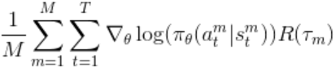

The above gradient is used to optimize the value of `theta <- theta + alpha*reinforce` in a gradient ascent fashion. Implementing any gradient ascent in PyTorch is done simply by taking the negative of the loss and using the desired loss function (Huber, MSE, etc). 

Policy-based methods are fast, but REINFORCE has its issues:
    1. It is inefficient in the sense that it throws out the trajectories collected by the policy while they might have contained useful information for further training.
    2. It has high variance; it can be really noisy as we are just taking M trajectories and their returns may not be representative of the overall performance of the policy.
    3. There are no clear credit assignment as whether an action is reinforced or not, only depends on the final output of the whole trajectory.

(Actor-Critic) PPO will be an algorithm which will resolve all the above. But first, we need to mention some small things we can do to make the situation a lot better. First, is to consider _future returns_ `R_t=r_t+gamma*r_{t+1}+ ...` instead of the whole episode return (3). We can also normalize these returns to have a noise reduction (2). For the first issue, we would want to use collected trajectories by old policy to update our new policy. Hence, we will have to change our objective function which will be called the _surrogate_ objective function in this case.

Let us review the construction of the _surrogate_ function, which gradient is essentially the negative of the agent's (actor's) loss. It is in fact similar to how REINFORCE was derived, but with one significant exception. The policies are going to change, so we will have a fixed old policy which we use to collect trajectories, and a new policy which we evaluate on those trajectories. The gradient of the objective function will have to change, and we can make this change, again by the ratio trick:


By using the formula of `P()` for both old and new policies (given above), we can calculate the gradient, restricted to each trajectory `tau`:


But notice we have cheated above! We did not take the gradient of the ratio `P(new)/P(old)` which obviously depends on the new parameters. We did not do so because we are going to _assume_ that the ratio is always equal to one! This is a major simplification and it is motivated from the observation that during the course of training, we can expect the old and new policies to be close to each other. Still, this simplification does have its issues ("falling over a cliff", as will be mentioned later) and __Proximal__ Policy Optimization (PPO) will make sure that this assumption of _proximality_ of old and new policy is _true_, and thus, will avoid those issues.

Therefore, to recap, we can solve the last two issues above by using future rewards, and normalizing them. The first issue can be resolved by updating `SGD_epoch` (4-8 usually, we will choose more, and we will choose Adam over SGD) many times the `theta` parameters, using `M` collected trajectories by the old policy and the surrogate function as the negative of the loss.

### 2.2. Actor-Critic methods
What if we could have the advantages of both policy-based and value-based methods in our algorithm? This is the purpose of Actor-Critic methods where an actor is the policy-based part, and the critic is the value-based part. The actor `pi_theta` chooses an action `a` given a state `s` with some probability (so it may be stochastic) `pi(a|s)`, while the critic estimates the action-value or the value of the state `Q(s,a)` or `V(s)`. This is supposed to bring down the variance of policy based methods as value based methods have low variance. But we will also get some bias which can be in fact controlled depending on how long we want our collected trajectories to be.  

In fact, in the __online__ version of Actor-Critic methods (like PPO), we can do even better by including the estimation of the advantage function `A(s,a)=Q(s,a)-V(s)` using Generalized Advantage Estimation (GAE) instead of future returns `R_t` in the surrogate function of the actor. We first collect trajectories using an _old_ policy. Then we calculate:

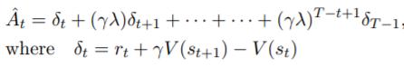

where the critic provides the  _value_ function of the old policy `V(s_t)` and `lambda` is the GAE hyperparameter which determines how much bias we want to introduce. If `lambda=1`, then it is just the Monte-Carlo full trajectory (least bias). If `lambda=0`, we get the TD-error (least variance). Hence, the actor's loss would be:


where `pi_theta` is the _new_ policy and `pi_theta'` the old one. The critic loss is simply `(V_new(s)-future_returns)**2`. For more details, see the PPO section.

In the __offline__ version of Actor-Critic methods (like DDPG), we need a replay buffer, but also a target and local version of the networks. The critic loss is just the TD-error loss for the action-value `Q_w(s,a)` (all similar to Q-learning) where `w` are the parameters of the critic. The actor loss is `-Q_w(s,pi_theta(a|s))`, which makes sense as we want to take the action with the _maximum_ (hence the negative sign) action-value. Next section will provide more details.

##### &nbsp;
## 3. DDPG

### 3.1. DDPG Review
Deterministic Policy Gradient (DPG) algorithm was introduced by [D. Silver et. al., 2014](http://proceedings.mlr.press/v32/silver14.pdf). DPG starts from a different set of ideas, namely the policy gradient theorem of [Sutton et al., 2000](https://papers.nips.cc/paper/1713-policy-gradient-methods-for-reinforcement-learning-with-function-approximation.pdf). The DPG _theorem_ provides the formula of the objective function given a parametrized policy by `theta`:


but replaces the stochastic policy in [Sutton et al., 2000](https://papers.nips.cc/paper/1713-policy-gradient-methods-for-reinforcement-learning-with-function-approximation.pdf) with one that includes no stochasticity, i.e. `mu_theta(s)` above providing the action _deterministically_ given state `s`. The form of this gradient is interesting, as it was believed prior to DPG, that any deterministic policy would need an optimization to find `argmax_a Q(s,a)`, which would have required a lot of samples. 

This algorithm is an instance of an actor-critic method, where the actor takes the action `mu_theta(s)`, and the critic evaluates off-line the action-value `Q(s,a)` of the action-states pair given by the experiences gathered using the actor. Therefore, we will need a `ReplayBuffer` which stores such experiences. The loss for the critic will simply be the TD-loss as in the Q-learning framework, and the loss of the actor is given by the formula above which is basically the chain rule applied on `Q(s,mu_theta(s))`. Hence, the actor loss is what it should be: `-Q(s,mu_theta(s))`, as maximizing the action-value of the chosen action is simply minimizing its negative. 

Given the algorithm above, just like it has been the case with other algorithms in RL involving a function approximator, one can plug in two Deep NN, one for the actor and one for the critic. This is what is achieved in [T. P. Lillicrap et. al., 2016](https://arxiv.org/pdf/1509.02971.pdf) and called Deep DPG, or DDPG. Of course, as the learning is done off-line, similar to Q-learning, a target version of these networks is required, giving in total four Deep NNs.

### 3.2. Implementation details
We follow mostly the suggestions in the paper for implementing DDPG in our continuous control _Reacher_ problem. The hyperparameters are chosen as follows

```python
#FOR DDPG
BUFFER_SIZE = int(1e6)  # replay buffer size
BATCH_SIZE = 128        # minibatch size
GAMMA = 0.99            # discount factor
TAU = 1e-3              # for soft update of target parameters
LR_ACTOR = 1e-3         # learning rate of the actor 
LR_CRITIC = 1e-3        # learning rate of the critic
WEIGHT_DECAY = 0        # Weight_decay for Adam optimizer
UPDATE_EVERY = 20       # every update_every steps update
LEARN_NUM = 10          # learn_num times
SEED=1                  # random seed
```

The network for both actor and critic is fully-connected with two hidden layers of size 400 and 300, initialized using  [_Xavier_ uniform ](http://proceedings.mlr.press/v9/glorot10a/glorot10a.pdf)`(-1/sqrt(fan_in),1/sqrt(fan_in))` initilization. Again, following the paper, we do batch normalization by using a batchnorm layer. The batch size is 128, different from 64 chosen in DDPG paper. Another change, which is usually not encouraged, has been to take the same learning rate for actor and critic, which gave us faster learning. Also, we did not try to tune the weight decay for the adam optimizer, so there could be better choices. But perhaps, the most important change which led to dramatically faster convergence was to tweak the [Ornstein-Uhlenbeck (OU)](https://en.wikipedia.org/wiki/Ornstein–Uhlenbeck_process) noise parameters. 

OU noise is implemented in `OUNoise.py` following the formula


The noise, which is induced in the chosen action, is supposed to be a better choice than the random epsilon decaying noise. This noise was introduced as a way to "generate temporally correlated exploration for exploration efficiency in physical control problems with inertia". In more precise terms, the noise is given by the velocity of a massive Brownian particle under the influence of friction. Hence, although the movement of the particle is random and its velocity is _overall_ random, but it is temporally correlated (it cannot suddenly jump from low to extremely high velocity). Further, the noise ultimately converges to a normal distribution with mean `mu` and variance `sigma**2/(2*theta)`. The implementation we provide below is precisely the formula above for `dt=1` as we are taking integer timesteps.
```python
dx = self.theta * (self.mu - x) + self.sigma * np.array([random.gauss(0,1) for i in range(len(x))])
```
It is important for the purpose of exploration that one has a significant noise, esp. at the beginning of training, but in order to let the agent also exploit as it gets better, we need to reduce the noise. If noise is high even after many episodes, the agent will have to really struggle to converge and training could take longer (on the other hand, it _may_ be more robust). For our purpose, we wanted to see how fast we can get to solve the environment. Therefore, we wanted to know how much noise is given to the action after about 100 episodes. We have to evaluate the mean of the absolute value of the noise as it gets close to the normal distribution with mean `mu` and variance `sigma**2/(2*theta)`. It is shown numerically in `DDPG_Train.ipynb` that for the hyperparameters given in DDPG paper, i.e. `sigma=0.2,theta=0.15` one gets a mean of about 0.3. Since actions are between -1 and 1 it means a 30% noise even after infinitely many steps! This is really high, and one may hope that lowering that noise could lead to faster training. We chose the values `sigma=0.02,theta=0.04` to get about 5% noise in the limit. The difference in faster convergence was obvious as shown below:

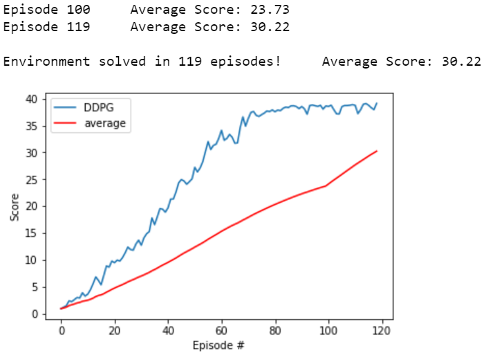

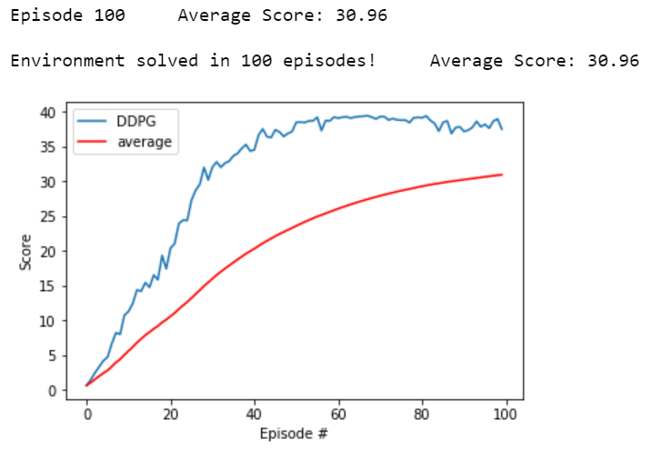

In the first case, where we did not change OU parameters, we solved the environment in 119 episodes. In the second case, it was in fact solved in 89 episodes as the training history shown in `DDPG_Train.ipynb` and the moving average crossing 30 at 90 episodes above demonstrate that. 

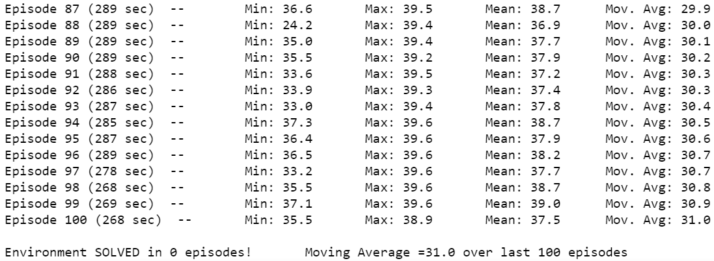

See [here](https://youtu.be/W8q6MNDnl8U) for a demonstration achieving near maximum perfect score of 39.67; we have also shown in the video how the agent smoothly goes for the goal location at the beginning of each episode.

##### &nbsp;
## 4. Actor-Critic PPO

### 4.1. PPO Review
Policy based methods are un-biased but suffer from high variance. One solution to this high variance was to introduce AC methods, and DDPG goes even further by making the training offline. But to maintain an online learning of the agent and enjoy its advantages of faster and a more (space) efficient training in general, we need more stabilization techniques. 

To stabilize the training, Trust Region Policy Optimization (TRPO) was introduced by [J. Schulman et. al., 2015](https://arxiv.org/pdf/1502.05477.pdf), where it was proposed that the surrogate function given by `(ratio_new_old*advantages).sum()` (as given in section 2.2) be optimized assuming a constraint on the KL distance of the old and new policy. What this constraint essentially does is to make sure that the new policy is not _that_ different from the old policy at each step. But this algorithm is not as easy as it may sound to implement as it is a second order algorithm; while there is linear approximation to the objective function (surrogate), there is a need to _quadratically_ approximate the constraint, hence using _second order_ derivatives in the optimization. Therefore the algorithm is rather complicated, but it is also not compatible with architectures that include noise (such as dropout) or parameter sharing (between the policy and value function, or with auxiliary tasks).

Proximal Policy Optimization (PPO) [J. Schulman et. al., 2017](https://arxiv.org/pdf/1707.06347.pdf) has the benefits of TRPO while being a first-order algorithm which is easier to implement. The idea was, instead of using a KL distance constraint, to perform a clipping in the surrogate function on each of the individual `ratio_new_old` term, and take the minimum between that and the original term multiplied by the advantage:

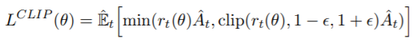

This clipping of the ratio is basically doing a similar job to KL distance constraint but in a much easier way to implement; it makes sure that the old and new policy are within a _comfortable_ zone of another which is described by `eps`. `eps` of course will decay over the course of training. 

Another justification for this clipping is what it does to avoid "falling over a cliff", i.e. avoid a crash during training. The surrogate function is supposed to estimate the expected returns as we move to the next policy. Recall in the formulation of the surrogate function (section 2.1), we made a significant simplification where we __assumed__ that the ratio of terms in "..." of the product below is very close to one:

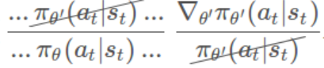

What this approximation implies is that if at some point the actual reward function declines rapidly like falling over a cliff, the surrogate function will _still_ predict higher and higher returns as it is assumed, through that approximation, that expected returns cannot be that different for the old and new policy. Hence it will make higher and higher changes in the policy by its gradient, and as the left picture shows, we might fall into a place where it is too late and we can never recover.

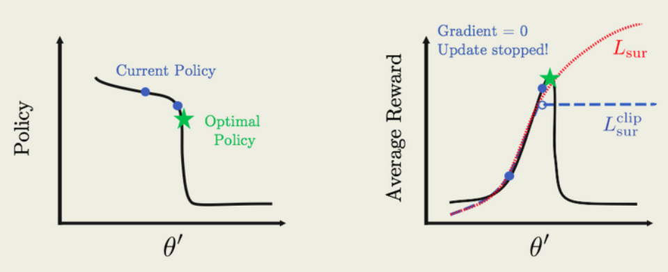

The clipping PPO introduces makes sure that in the case where we are approaching a cliff, as the change in policy becomes more significant, i.e. the ratio 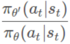 is big or small, outside a very small _neighborhood_ of the old policy, the value of the ratio is clipped _constantly_ at `1+eps`. This implies that a gradient _zero_ is obtained unless the new policy is in that very small neighborhood of the old policy (so the optimizer can not change much the old policy). 

### 4.2. Implementation details
PPO can be implemented in an actor only setting but to make it more powerful, one can implement it in an actor-critic fashion. This presents some challenges in the continuous action context, as the actor has to be stochastic in that it should output the _probability_ of an action taken based on its value.

What do each of actor and critic do? The actor is going to first compute the _mean of the normal distribution_ from which the model chooses to sample the action from. While the `std` is not computed, it will still be an `nn.Parameter` initialized at 1 in all four dimensions of the action. This will be optimized by being introduced in the loss function by taking the log probs of the chosen actions and/or the entropy of the distribution, as we will see later on. The agent then samples from the distribution and computes the log probabilities of the samples. The critic part will of course compute the values of the states.

Now let us describe the training process. First, the agent collects some trajectories using the (old) policy and we collect all its outputs (actions, log_probs, entropies and values).

Then comes the optimization, where we choose to update `SGD_epoch=30` times using the old policy trajectories. The `surrogate` function takes the old outputs, computes the new probabilities and values of the old trajectories, and constructs the surrogate PPO function with (decaying `*.999`) clipping `eps=0.02`.

```python
actions, new_log_probs, new_v,  new_entropy = states_actions_to_prob(policy,states, actions) 
ratio = (new_log_probs-old_log_probs).exp()
ratio_clamped = torch.clamp(ratio, 1-epsilon, 1+epsilon)
#computing Lsur_clipped
Lsur = advantage*ratio
Lsur_clamped = advantage*ratio_clamped
Lsur_clipped = torch.min(Lsur,Lsur_clamped)
```

In the construction of the advantage using the old values and future returns, we decided to compute the Generalized Advantage Estimate with hyperparameter `eta=0.95` (usually it is between `0.92` and `0.98`, with `1.` giving MC and `0.` giving TD). Also, we decided to normalize the advantage as it is usually suggested to do so. _But we observed that normalizing the rewards made it impossible to solve the environment_. The reason could lie in the sparseness and smallness of the rewards esp. at the beginning.

```python
returns,advantage,td_error=([list() for _ in range(len(states))] for _ in range(3))
tmp_r = np.zeros((20,1))
returns = [0 for i in range(len(v))]
advantage = [0 for i in range(len(v))]
tmp_adv = np.zeros((20, 1))
next_value=np.zeros((20,1))
for i in reversed(range(len(states))):
    if i<len(states)-1: 
        next_value = v[i+1]
    tmp_r = rewards[i] + discount  * tmp_r
    tmp_td_error = rewards[i] + discount * next_value - v[i]
    tmp_adv = tmp_adv * eta * discount  + tmp_td_error
    returns[i] = tmp_r
    advantage[i] = tmp_adv
returns=np.array(returns)
advantage=np.array(advantage)
#NORMALIZING:
#         mean = np.mean(returns, axis=1) 
#         std = np.std(returns, axis=1) + 1.0e-10
#         returns = (returns - mean[:,np.newaxis])/std[:,np.newaxis]
#notice we only normalize advantage not rewards which are sparse and low (esp. at beginning)
returns = torch.tensor(returns, dtype=torch.float, device=device)
mean = np.mean(advantage, axis=1) 
std = np.std(advantage, axis=1) + 1.0e-10
advantage = (advantage - mean[:,np.newaxis])/std[:,np.newaxis]
advantage = torch.tensor(advantage, dtype=torch.float, device=device)
```

The clipped surrogate loss is not the only part of the loss function. After all, we have a critic and we need a value loss as well. This is implemented by comparing the new values and the (old) future returns which are an unbiased estimator of the value of the state. We mentioned that entropy is going to play a role in the loss function. There are two ways to account for `std` in the loss function. Both come with a (decaying `*.995`) coefficient `beta=0.01`:
    -One is the `new_entropy` which is the entropy of the new distribution calculated _solely_ in terms of `std`. This term ensures that the entropy of the whole distribution is high, i.e. there is more exploration. But since `beta` is decaying, its effect will decrease over time which is what is desired in exploration vs exploitation. 
    -The other is the `new_policy_entropy` which is like a sample estimation of `new_entropy` and it has the same effect as the `new_entropy`. Hence, we will also refer to `new_entropy` as the _exact_ entropy and `new_policy_entropy` as the _approximate_ entropy (of the actor's distribution output).

```python
#computing value loss and entropy and KL distances
value_loss=(new_v-returns)**2
new_entropy=torch.mean(new_entropy,dim=2,keepdim=True)
new_policy_entropy = -(new_log_probs.exp()*new_log_probs)
new_old_policy_KL = (new_log_probs.exp()*(new_log_probs-old_log_probs))
```

Finally, there is also a term which comes from TRPO which we decided to experiment with. The cross entropy term of the KL distance between the new and old policy called `new_old_policy_KL`. This can be seen as a sample estimate of the KL distance of the old and new distribution of the actor (hence also referred to as the _approximate_ KL). It has a _constant_ coefficient of `delta=0.1`. By introducing it in our loss function, its effect is the same as the clipping; it ensures that the new and old policies are close to each other (i.e. encouraging smaller KL distances between their respective distribution). We note that as explained in [PPO paper, p.2](https://arxiv.org/pdf/1707.06347.pdf), KL-distance used as a constraint by TRPO in its second-order algorithm is usually __not__ encouraged to be used as a penalty: "TRPO uses a hard constraint rather than a penalty because it is hard to choose a single value of `delta` that performs well across different problems—or even within a single problem, where the the characteristics change over the course of learning." Still we decided to experiment with this!

Finally, before running the optimizer, we implement a gradient clipping of `0.2`. We experiment with different loss functions as described below, which come from different choices of including the entropies and approximate KL distance.
- `simplest`: No consideration of entropies or KL
- `entropy`: Consider both forms of entropies
- `entropy_exact`: Consider only new policy distribution entropy
- `entropy_approximate`: Consider only new policy entropy
- `KL_approximate`: Consider only new and old policy KL distance
- `KL_entropy_approximate`: merging `entropy_approximate` and `KL_approximate`

Here, we summarize all the important hyperparameters:

```python
max_t = 1000      #number of steps in collecting trajectories
SGD_epoch = 30    #number of updates on a fixed old policy
discount = .99    #discount factor
eta = 0.95          #the GAE (TD(lamda)) hyperparameter
epsilon = 0.2     #the epsilon in surrogate clipping
c1 = 0.5          #value loss scalar
beta = .01        #entropy scalar
delta = 0.1         #KL-distance scalar
clip = 0.2          #gradient clipping
```

The results are detailed in the score plots. By choosing `entropy_exact`, we achieved the best run in 144 episodes, done in 16 minutes (on an NVIDIA 980Ti; compare to DDPG which took about 7 hours!!). Of course, this was not always the case (instability of Policy-based methods or just RL in general!) and another run led to over 400 episodes. Below are these two runs, plus the one using the `KL_entropy_approximate`.

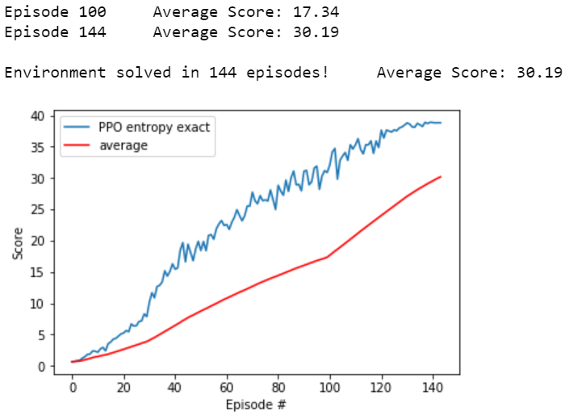

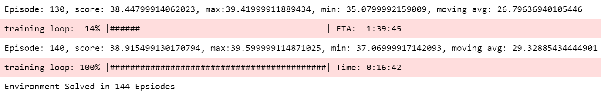

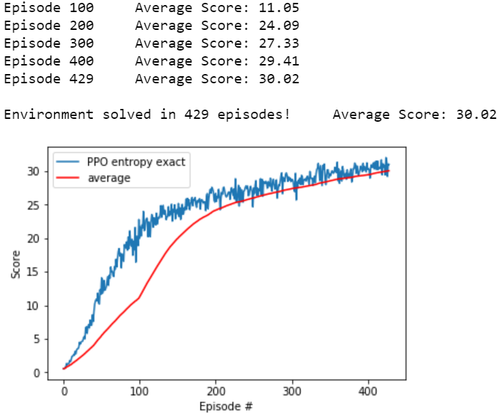

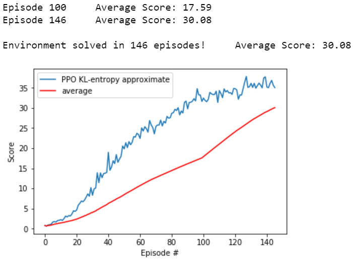

Most of our experiments were done without batch normalization, and with fully connected hidden layers of size 512, _not_ uniformly initialized like in DDPG. Some runs were made using smaller like 400,300 hidden layer sizes. Still, almost all of the runs solved the environment in around 200 episodes and in less than 30 minutes real time. Between PPO and DDPG, the obvious choice is therefore PPO as it solves the environment much faster and also, like DDPG, is stable and achieves near maximum perfect score when evaluated (see [here](https://youtu.be/kvc0Z39l9ck)). 

##### &nbsp;
## 5. D4PG
So far, we have tried to implement the most famous actor-critic method with online and offline learning. Next is D4PG which should be an improvement over DDPG in general. But in terms of real time, each episode takes a lot more time (almost four times as much as DDPG). Therefore, although we have prepared the code and the agent can be trained, since we did not have enough computational bandwidth, we will postpone tuning the hyperparameters and solving the environment using D4PG to future works. Below, we will explain some of motivations/intuitions behind D4PG and discuss the code just like in previous cases.

### 5.1. D4PG Review
One of the major improvements on DQN, was the Distributional DQN introduced by [M. G. Bellemare et. al., 2017](https://arxiv.org/pdf/1707.06887.pdf). There are many reasons to try to approximate the _distribution_ of the action-value instead of the action-value itself. As mentioned in the paper: "From an algorithmic standpoint, there are many benefits to learning an approximate distribution rather than its approximate. The distributional Bellman operator preserves multimodality in value distributions, which we believe leads to more stable learning. Approximating the full distribution also mitigates the effects of learning from a nonstationary policy. As a whole, we argue that this approach makes approximate reinforcement learning significantly better behaved."

But to really be sure that what is being done makes sense, we need an analog of the Bellman's equations:


To do so, instead of `Q(x,a)`, we assume a distribution `Z(x,a)`:


We also need an analog of the contraction operator, which allows us to argue for the existence of the optimal policy:


In the distributional setting, this becomes of the form:


where `P^{\pi}` is the distributional transition operator and the equality is the equality of distributions.


But contraction is meaningless without a proper metric. The metric used here is the Wasserstein p-metric `d_p`, which we refer to the paper for its formula. The important part is that the contraction operator above is indeed a contraction with respect to that metric, hence we can see that the distributional approach has the theoretical motivation. What happens in the implementation though, is a bit more complicated, and to an extent different from what was shown so far. First, it is shown in the paper that, even in the case of continuous control, instead of choosing gaussian distribution (which are continuous), it is better to discretize and choose a categorical distribution!

This means we have finitely many _atoms_ (with probabilities assigned to them) which dictate what the possible values of the action could be (and their probabilities). Further, we will not use the Wasserstein metric when comparing input and target distribution. Instead we will simply use the cross-entropy term in the KL distance of the distributions. This has been shown empricially to actually perform better than trying to optimize Wasserstein metric directly! And it will converge to the true value of the Wasserstein metric in the limit (see Figure 10(a),(b) in the [paper](https://arxiv.org/pdf/1707.06887.pdf)).

Of course, implementing the categorical distribution has its own issues. It turns out that comparing the target and input using directly the equation 


does not make sense, as one side is a distribution on different atoms (shifted and scaled)! Since we want our atoms to be fixed, we need some sort of projection operator, which will take the distribution on the target and find the _closest_ distribution to it on our fixed atoms. Pictorially, we would like to do something like this:


This operator `\Phi` is described in [algorithm 1, p.6](https://arxiv.org/pdf/1707.06887.pdf) which is an alternative implementation of eq.7, in the same page. The intuition behind the projection is clear: Given any new atom on the real numbers line, find the closest two fixed atoms to it (on its left and right) and split its score onto those fixed atoms. This splitting takes into account how far the new atom is to the two closest atoms. It may not seem that obvious, but this is really what the equation and the algorithm are doing as explained below:


This finishes the discussion behind the background of D4PG so that we get to what D4PG is. D4PG or _Distributed Distributional Deep Deterministic Policy Gradient_ algorithm was introduced by [G. Barth-Maron et. al., 2018](https://arxiv.org/pdf/1804.08617.pdf) by building on the previous approach and applying it on DDPG. Therefore, the essential change is that the critic of DDPG will output a (categorical) distribution `Z(x,a)` and follow the corresponding learning algorithm. There will be more changes and their details explained further below.

### 5.2. Implementation details
As mentioned in the beginning, we have not trained/tuned the agent to solve the environment. Here, we explain more details of the changes going from DDPG to D4PG. The main difference was already discussed above. 

To implement a categorical distribution, we have to choose the number of atoms; following D4PG paper, `ATOMS=51`. To know the value of each atom, we need to fix an interval `[V_MIN,V_MAX]` which will be divided equally by the atoms. Ideally, the interval will have to contain the minimum and maximum discounted expected return, as the atoms are supposed to be an action-value. The maximum, using `GAMMA=0.99` for 1000 steps of reward 0.04 turns out to be close to 4, and the minimum is obviously 0. There could be better choices, esp. it may be that smaller values of `V_MAX` would give better results. 

Also, following the paper, it was demonstrated that using a rollout length of 5 instead of simple TD-learning gives better results. This means two things: First, we have to change the class `ReplayBuffer` to one which contains samples of 5 consecutive step. Second, our target distribution prior to being projected is of the form:


where `N=5` in our case, and `w',theta'` are the weights of the target critic and target actor, respectively. Here we list all hyperparameters:

```python
#For D4PG
BUFFER_SIZE = int(1e6)  # replay buffer size
BATCH_SIZE = 128      # minibatch size
GAMMA = 0.99            # discount factor
TAU = 1e-3              # for soft update of target parameters
LR_ACTOR = 1e-4        # learning rate of the actor, this time for D4PG we choose different lr for actor and critic
LR_CRITIC = 1e-3        # learning rate of the critic
WEIGHT_DECAY = 1e-5    #weight decay parameter for adam optimizer
UPDATE_EVERY = 20
LEARN_NUM = 10
EPSILON = 1.0           # explore->exploit noise process added to act step for gaussian noise, works if eps_gauss=True in Agent
EPSILON_DECAY = 1e-6   #for linear rate of decay  
ATOMS=51            #number of atoms of categorical distribution
ROLLOUT_LENGTH=5    #rollout length taken for trajectory 
V_MAX=4             #V_MAX and V_MIN are gonna be the interval within which atoms reside
V_MIN=0
HARD_UPDATE=350    #hard update of target networks at each hard_update many steps 
SEED=1
```
There is another augmentation: Prioritized Replay. It would require storing the "TD-errors", which in this case we recall, is the cross entropy term in the KL-distance of projected target and local critic distributions. We chose not to implement it as it did not seem to show much gains on the non-prioritized version with rollout length 5 (as seen in [Figure 2,3 in p.6-7](https://arxiv.org/pdf/1804.08617.pdf)). Finally, the noise is chosen in the paper to be a simple additive gaussian noise, which we have implemented along side OU noise and we can choose which one to apply in the training. Also there is an option of hard update (every 350 steps as fixed above) which was demonstrated in the paper to be better than soft-update. Our code also gives the option to choose either.

Delving deeper into the algorithm, the change from DDPG to D4PG of the neural networks is in the last layer of the critic, where we implement a softmax on a 51 nodes output layer. The training of the critic is done as follows:

```python
# Get predicted next-state actions and Q values from target models
with torch.no_grad():            
    actions_next = self.actor_target(next_states[self.rollout_length-1])
    Z_target_next = self.critic_target(next_states[self.rollout_length-1], actions_next)
    # Compute returns_tmp size B*1
    returns_tmp = np.array([rewards[i]*(gamma**i) for i in range(self.rollout_length)]).sum(axis=0)
    #dimension B*self.num_atoms
    Y_target = returns_tmp + (gamma**self.rollout_length * Z_target_next * (1 - dones[self.rollout_length-1]))
    Y_target = self.project_dist(Y_target,returns_tmp,gamma)

# Compute critic loss
self.critic_local.train()
Z_expected = self.critic_local(states[0], actions[0])
#to perform prioritized here need to add weight=BUFFER_SIZE/p with p the probability
critic_loss = -(Y_target*torch.log(Z_expected+1e-10)).sum(dim=1).mean()
# Minimize the loss
self.critic_optimizer.zero_grad()
critic_loss.backward()
torch.nn.utils.clip_grad_norm_(self.critic_local.parameters(), 1)
self.critic_optimizer.step()
```

There are two ways of implementing the projection of the target distribution. One is following directly its formula in [eq.7, p.6](https://arxiv.org/pdf/1707.06887.pdf), and the other is following the algorithm 1 in the same page. We implement both here; we observed that implementing the equation directly can be done much faster.

```python
def project_dist(self,dist,returns_tmp,gamma):
    """ 
    Projecting the categorical distribution of target as shown in "A Distributional Perspective on Reinforcement Learning" paper 
    """
    proj_atoms=torch.zeros((self.num_atoms,self.batch_size)).to(device)
    dist=dist.permute([1,0]) #num_atoms*B
    for i in range(self.num_atoms):
        #size B 
        to_proj=returns_tmp.squeeze()+gamma**self.rollout_length * self.atoms[i]
        proj_atoms[i]=torch.clamp(torch.tensor(to_proj),self.V_min,self.V_max)
        
    #direct implementation of the eq (7) in Distributional paper:
#    new_dist=torch.zeros_like(dist).to(device)
#    for i in range(self.num_atoms):
#        new_dist[i]=(torch.clamp(1-torch.abs(proj_atoms-self.atoms[i])/self.delta,0,1)*dist).sum(dim=0)

    #implementation of algorithm 1 
    #size 1* num_atoms * num_atoms*B = 1*B
    new_dist=torch.zeros_like(dist).to(device)
    #here, distributional paper uses the best_value instead of dist[j] which would mean taking expectation of dist; 
    #but implementating dist[j] seems to give better results!
    for j in range(self.num_atoms):    
        bj=torch.zeros(self.batch_size).to(device)
        bj=(proj_atoms[j]-self.V_min)/self.delta
        #shape B
        u=torch.ceil(bj).long()
        l=torch.floor(bj).long()
        new_dist[l]+=dist[j]*(u.float()-bj)
        new_dist[u]+=dist[j]*(bj-l.float())
    return new_dist.permute([1,0])
```

##### &nbsp;
## 6. Possible Future Improvements and Directions
In this project, we implemented various methods. But more can be done:
1. Train the D4PG agent and compare its performance to other models. The algorithm seems to take quite some time and requires lots of computations. It would be great if we could optimize the algorithm.
2. We did not implement methods that were discovered prior to DDPG,PPO, or D4PG. This includes TRPO, A2C, A3C, etc. In this example, it seems like TRPO should also be a great algorithm as mentioned [here](https://arxiv.org/abs/1604.06778).
3. PPO did not learn under rewards normalization. We believe this was due to the sparseness and/or smallness of the rewards. Similarly, DDPG seemed to really depend on batch normalization as removing the bathnorm layer made the agent not learn. This is also something that should be analyzed in more depth.
4. Finally, a more challenging project is to help this [Crawler](https://github.com/Unity-Technologies/ml-agents/blob/master/docs/Learning-Environment-Examples.md#crawler) to learn to walk fast! We hope to work on this in the future.


